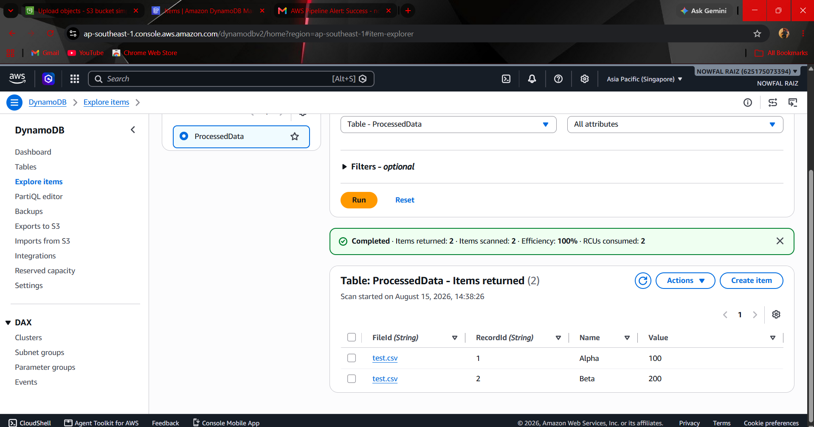
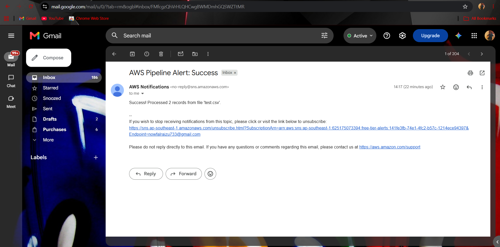

# ☁️ Event-Driven AWS Serverless File Processing & Auditing Pipeline

An automated end-to-end data processing and security pipeline built on **AWS** within **Free Tier** limits. The system automatically ingests CSV uploads, processes data via a serverless execution environment, persists items to a NoSQL database, sends real-time email notifications, and logs administrative audit events.

---

## 🏗️ System Architecture

```text
[ Admin User / EC2 ] ──> [ S3 Ingestion Bucket ]
                               │
                     (Object Created Trigger)
                               │
                               ▼
                    [ AWS Lambda Function ] (IAM Role)
                               │
         ┌─────────────────────┼─────────────────────┐
         ▼                     ▼                     ▼
 [ DynamoDB Table ]    [ Amazon SNS Alert ]  [ CloudWatch Logs ]
   (Data Storage)      (Email Notification)   (Metrics & Alarms)
         ▲                                           ▲
         └─────────────── [ CloudTrail ] ────────────┘
                       (Security Auditing)

🛠️ AWS Services Integrated (9 Total)
Amazon S3: Ingestion bucket acting as the primary event source for file uploads.

AWS Lambda: Serverless Python execution engine parsing incoming CSV data.

Amazon DynamoDB: NoSQL database storing extracted record items.

Amazon SNS: Managed alert system publishing execution reports to email.

Amazon VPC: Custom virtual cloud network with public subnets and internet gateway.

Amazon EC2: Linux management instance inside the VPC for admin operations.

AWS IAM: Fine-grained execution policies connecting Lambda to S3, DynamoDB, and SNS.

Amazon CloudWatch: Execution log inspector and metric alarm for failure tracking.

AWS CloudTrail: Management event logger tracking account API operations to S3.

## 📸 Implementation Proof

### 1. DynamoDB Data Ingestion


### 2. Real-Time Email Notification


## 📄 Sample Input (`sample_data/test.csv`)

```csv
id,name,value
101,Alpha,10
102,Beta,20
103,Gamma,30


